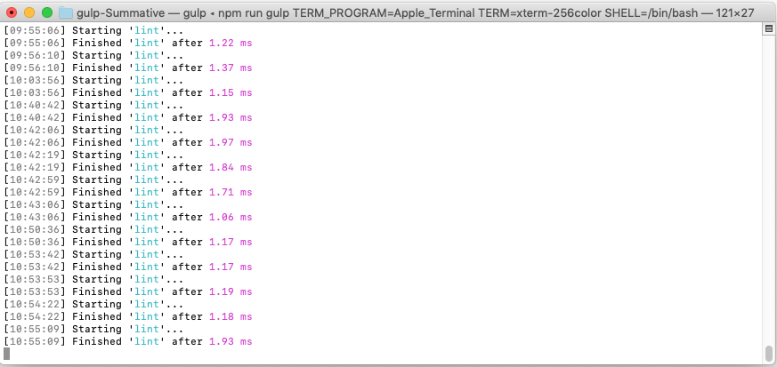
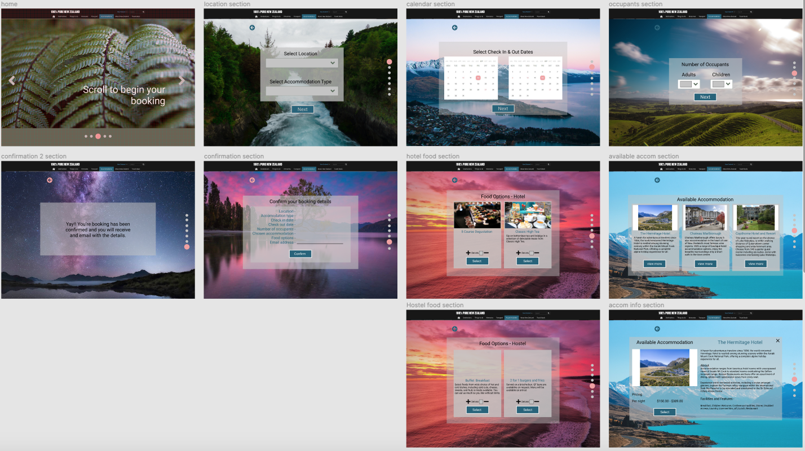

# Foundation Coding by Ambar Williams

### Project description
 I am creating a one page accommodation booking site that is simple and clear for all users to follow in the hopes that it attracts every day New Zealanders to reconnect with NZ culture and #DoSomethingNewNZ. This site uses a full page js slider to navigate through the booking process.

### HTML and CSS validation review
#### html validation
https://validator.w3.org/nu/#textarea

Document checking completed. No errors or warnings to show.

#### css validation
https://jigsaw.w3.org/css-validator/validator

No error found

### Javascript lint review
 I used Gulp for javascript linting. As of date July 1st 2021 no errors are observed.

 

### My chosen .js librarie/s and plugin/s
- jQuery
- Bootstrap cards https://getbootstrap.com/docs/5.0/components/card/
- Daterangepicker https://www.daterangepicker.com
- Fullpage js
- Font awesome
- Google fonts.

### Javascript style guide reference
 https://github.com/rwaldron/idiomatic.js/

 I used single quotes throughout the whole document but there was one section where I had to use double quotes on the slide4 counter code (from line 261) as the plug in would break the code for the counter if this was changed to single quotes.

### Production tools and workflow items
- Atom
- Gulp
- Github
- Figma
- Miro board
- Google docs

### Figma prototype

https://www.figma.com/proto/wJQ9JDWS8aCM0gqUnOJTKB/Module-2-Summative?node-id=101%3A2&scaling=contain&page-id=0%3A1

### Evaluation

I am happy with the over all design of this one page site. When I started coding I ran into full page.js plugin hiccups that halted progress and took a few days to wrap my head around.

In my solution for the problem at hand I mentioned wanting to promote the 'Recharge Season' that is a section on the original TourismNZ site. I was not able to execute my own version of this due time restraints.

I have learnt a lot about more javascript coding through this project and I am happy with the functionality that this site has.

Future amendments would include adding the full range of accomodation selection cards and the food cards that are associated with them. Due to the time restraints I have only been able to make the hotel card and hotel food cards functionable.  

The milestones that I had set for myself were very achievable for the first couple of weeks during this project, however the hiccups that I ran into and moving house in that time, shortened the time that I had allowed for coding. I had originally planned to have all coding completed within 2-3 days before hand in but in the end I was finalising the code on the day of hand in. I am still very proud of what I managed to achieve.
